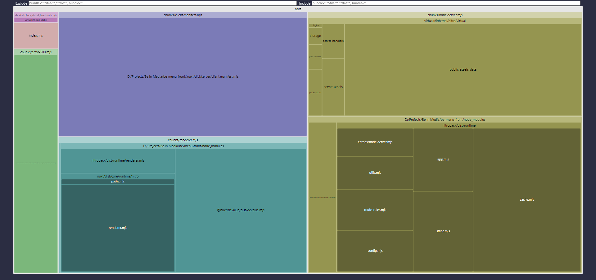
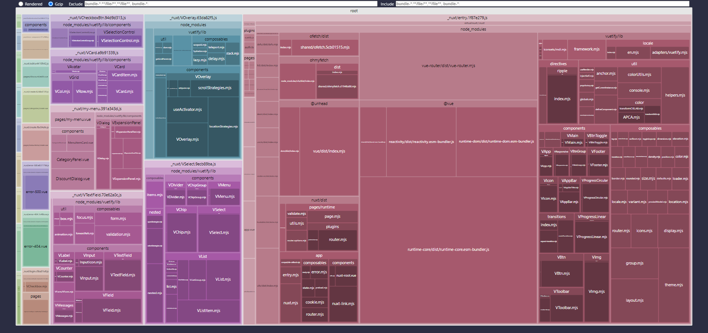

## Be In Media - Web development Recruitment test (Frontend)

This is the front of the restaurant menu. you can find the backend project [here](https://github.com/roduankd/be-in-media-web-development-recruitment-test)

## Bundle

### Build output
```bash
i Building client...                                                                                                                                                                                                          14:09:38
vite v4.1.1 building for production...
✓ 382 modules transformed.
.nuxt/dist/client/manifest.json                                         9.84 kB
.nuxt/dist/client/_nuxt/materialdesignicons-webfont.739dc70d.woff2    391.69 kB
.nuxt/dist/client/_nuxt/materialdesignicons-webfont.6d5e4be4.woff     568.65 kB
.nuxt/dist/client/_nuxt/materialdesignicons-webfont.c02d41ce.ttf    1,261.79 kB
.nuxt/dist/client/_nuxt/materialdesignicons-webfont.f5966bae.eot    1,262.01 kB
.nuxt/dist/client/_nuxt/login.1ea139e1.css                              0.08 kB │ gzip:  0.08 kB
.nuxt/dist/client/_nuxt/AuthenticationCard.e6826268.css                 0.21 kB │ gzip:  0.21 kB
.nuxt/dist/client/_nuxt/VOverlay.4877d058.css                           0.93 kB │ gzip:  0.35 kB
.nuxt/dist/client/_nuxt/error-500.aa16ed4d.css                          1.95 kB │ gzip:  0.74 kB
.nuxt/dist/client/_nuxt/VCheckboxBtn.74f78248.css                       2.33 kB │ gzip:  0.64 kB
.nuxt/dist/client/_nuxt/error-404.23f2309d.css                          3.63 kB │ gzip:  1.12 kB
.nuxt/dist/client/_nuxt/my-menu.0441e37e.css                            7.95 kB │ gzip:  1.52 kB
.nuxt/dist/client/_nuxt/VCard.4ee4699e.css                              8.57 kB │ gzip:  1.77 kB
.nuxt/dist/client/_nuxt/VTextField.b5e12f5c.css                        17.45 kB │ gzip:  2.99 kB
.nuxt/dist/client/_nuxt/VContainer.5384e9e0.css                        18.38 kB │ gzip:  1.97 kB
.nuxt/dist/client/_nuxt/VSelect.f26669e5.css                           25.43 kB │ gzip:  3.79 kB
.nuxt/dist/client/_nuxt/entry.7680523e.css                            592.95 kB │ gzip: 83.91 kB
.nuxt/dist/client/_nuxt/_plugin-vue_export-helper.c27b6911.js           0.09 kB │ gzip:  0.10 kB
.nuxt/dist/client/_nuxt/composables.c819d25b.js                         0.10 kB │ gzip:  0.11 kB
.nuxt/dist/client/_nuxt/auth.5d5b6499.js                                0.19 kB │ gzip:  0.17 kB
.nuxt/dist/client/_nuxt/guest.a3425fb2.js                               0.19 kB │ gzip:  0.18 kB
.nuxt/dist/client/_nuxt/unverified.704c9e1e.js                          0.21 kB │ gzip:  0.17 kB
.nuxt/dist/client/_nuxt/verified.4ff845e1.js                            0.22 kB │ gzip:  0.17 kB
.nuxt/dist/client/_nuxt/VContainer.32b760f1.js                          0.27 kB │ gzip:  0.22 kB
.nuxt/dist/client/_nuxt/_...slug_.1cfa642e.js                           0.28 kB │ gzip:  0.23 kB
.nuxt/dist/client/_nuxt/index.e5b48bd4.js                               0.35 kB │ gzip:  0.27 kB
.nuxt/dist/client/_nuxt/AuthenticationCard.68efe172.js                  0.70 kB │ gzip:  0.39 kB
.nuxt/dist/client/_nuxt/edit.e4410542.js                                1.26 kB │ gzip:  0.70 kB
.nuxt/dist/client/_nuxt/error-component.317af968.js                     1.27 kB │ gzip:  0.66 kB
.nuxt/dist/client/_nuxt/create.62dbd739.js                              1.84 kB │ gzip:  0.92 kB
.nuxt/dist/client/_nuxt/error-500.e837779d.js                           1.98 kB │ gzip:  1.04 kB
.nuxt/dist/client/_nuxt/create.fbc04afe.js                              2.04 kB │ gzip:  0.97 kB
.nuxt/dist/client/_nuxt/error-404.7c4f8cce.js                           2.32 kB │ gzip:  1.20 kB
.nuxt/dist/client/_nuxt/login.c5ba01e8.js                               2.62 kB │ gzip:  1.25 kB
.nuxt/dist/client/_nuxt/VCheckboxBtn.94d9d313.js                        5.05 kB │ gzip:  1.94 kB
.nuxt/dist/client/_nuxt/VCard.a9b91339.js                               7.47 kB │ gzip:  2.64 kB
.nuxt/dist/client/_nuxt/my-menu.391a343d.js                            11.26 kB │ gzip:  4.10 kB
.nuxt/dist/client/_nuxt/VTextField.70e62a0c.js                         18.53 kB │ gzip:  6.69 kB
.nuxt/dist/client/_nuxt/VOverlay.63da82f5.js                           23.22 kB │ gzip:  8.39 kB
.nuxt/dist/client/_nuxt/VSelect.9ecb89ba.js                            26.52 kB │ gzip:  8.67 kB
.nuxt/dist/client/_nuxt/entry.1f87e279.js                             223.73 kB │ gzip: 79.85 kB
√ Client built in 12977ms                                                                                                                                                                                                     14:09:51  
i Building server...                                                                                                                                                                                                          14:09:51  
vite v4.1.1 building SSR bundle for production...
✓ 1 modules transformed.
.nuxt/dist/server/server.mjs  0.10 kB │ map: 0.20 kB
√ Server built in 48ms                                                                                                                                                                                                        14:09:51
√ Generated public .output/public                                                                                                                                                                                       nitro 14:09:51
i Building Nitro Server (preset: node-server)                                                                                                                                                                           nitro 14:09:51
Export "useNitroApp" of module "node_modules/nitropack/dist/runtime/app.mjs" was reexported through module "node_modules/nitropack/dist/runtime/index.mjs" while both modules are dependencies of each other and will end up in different chunks by current Rollup settings. This scenario is not well supported at the moment as it will produce a circular dependency between chunks and will likely lead to broken execution order.
Either change the import in "node_modules/nuxt/dist/core/runtime/nitro/renderer.mjs" to point directly to the exporting module or reconfigure "output.manualChunks" to ensure these modules end up in the same chunk.
√ Nitro server built                                                                                                                                                                                                    nitro 14:09:54
  ├─ .output/server/package.json (968 B) (387 B gzip)
  ├─ .output/server/index.mjs (484 B) (258 B gzip)
  ├─ .output/server/chunks/rollup/_virtual_head-static.mjs.map (111 B) (112 B gzip)
  ├─ .output/server/chunks/rollup/_virtual_head-static.mjs (301 B) (217 B gzip)
  ├─ .output/server/chunks/renderer.mjs.map (18.6 kB) (3.31 kB gzip)
  ├─ .output/server/chunks/renderer.mjs (14.8 kB) (4.63 kB gzip)
  ├─ .output/server/chunks/node-server.mjs.map (84.1 kB) (5.93 kB gzip)
  ├─ .output/server/chunks/node-server.mjs (31.2 kB) (8.74 kB gzip)
  ├─ .output/server/chunks/error-500.mjs.map (1.06 kB) (390 B gzip)
  ├─ .output/server/chunks/error-500.mjs (4.26 kB) (1.82 kB gzip)
  ├─ .output/server/chunks/client.manifest.mjs.map (9.86 kB) (1.18 kB gzip)
  └─ .output/server/chunks/client.manifest.mjs (13 kB) (1.64 kB gzip)
Σ Total size: 2.83 MB (646 kB gzip)
```

### Server Bundle


### Client Bundle


## Setup

Make sure to install the dependencies & create the proper `.env` file.

```bash
npm install
cp .env.example .env
```

## Development Server

Start the development server on http://localhost:3000

```bash
npm run dev
```

## Production

Build the application for production:

```bash
npm run build
```

Locally preview production build:

```bash
npm run preview
```

Check out the [deployment documentation](https://nuxt.com/docs/getting-started/deployment) for more information.
